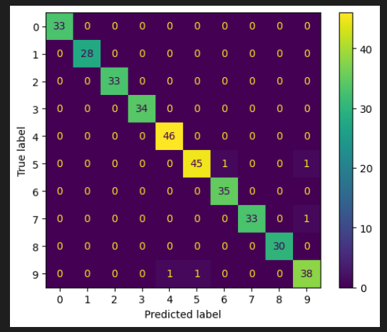
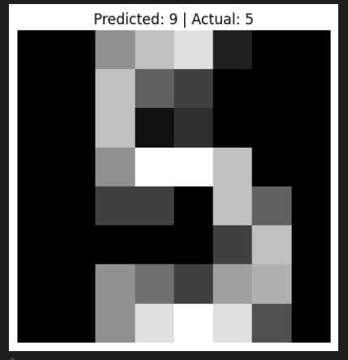

# Handwritten Digit Recognition using Machine Learning

## Project Overview

This project is a beginner-friendly Machine Learning project that recognizes handwritten digits (0–9) using the Scikit-learn Digits dataset. A K-Nearest Neighbors (KNN) classifier is trained to predict the correct digit from an input image.

The main objective of this project is to understand the complete Machine Learning workflow, from loading data to training, evaluating, and saving a model.

---

## Dataset

The project uses the built-in Digits dataset provided by Scikit-learn.

- Total Samples: 1797
- Image Size: 8 × 8 pixels
- Number of Classes: 10 (Digits 0–9)

Each image is converted into 64 numerical pixel values which are used as input features for the model.

---

## Technologies Used

- Python
- Scikit-learn
- NumPy
- Matplotlib
- Joblib
- Jupyter Notebook
- VS Code

---

## Project Structure

```
Project_01_Digit_Recognizer/
│
├── data/
├── models/
│   └── digit_classifier.pkl
├── notebooks/
│   └── digit_recognition.ipynb
├── README.md
└── requirements.txt
```

---

## Project Workflow

1. Import required libraries
2. Load the digits dataset
3. Explore the dataset
4. Visualize sample handwritten digits
5. Prepare features and labels
6. Split the dataset into training and testing sets
7. Train the KNN classifier
8. Predict the test data
9. Evaluate the model using Accuracy Score
10. Display Confusion Matrix
11. Analyze incorrect predictions
12. Save the trained model
13. Load the saved model for future use

---

## Machine Learning Model

This project uses the **K-Nearest Neighbors (KNN)** classification algorithm.

KNN predicts the class of a new sample by looking at the nearest training samples and choosing the most common class among them.

---

## Model Performance

Accuracy Achieved:

**98.61%**

The model correctly predicts most handwritten digits with very few incorrect classifications.

---


## Project Output

### Confusion Matrix



---

### Sample Prediction



## Future Improvements

Some possible improvements include:

- Using Convolutional Neural Networks (CNN)
- Training on larger handwritten datasets
- Building a web application using Flask or Streamlit
- Allowing users to draw digits and get real-time predictions

---

## Learning Outcomes

Through this project, I learned:

- Machine Learning workflow
- Dataset exploration
- Data visualization
- Train-Test Split
- Model training using KNN
- Model evaluation
- Confusion Matrix
- Saving and loading trained models using Joblib
- Organizing a Machine Learning project

---

## Author

**Ravina**

B.Tech Computer Science Engineering

Machine Learning Beginner 🚀